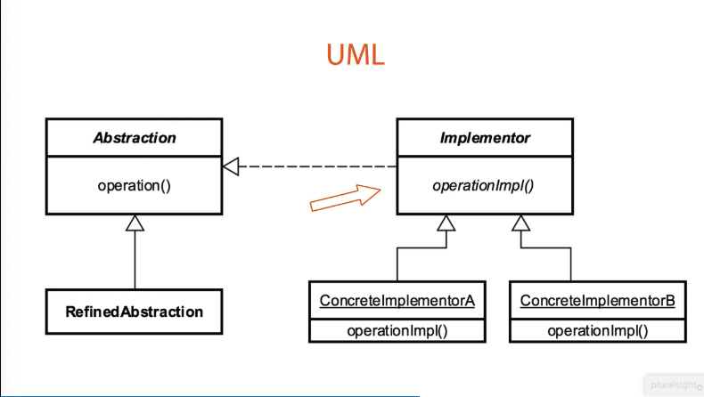

### Bridge
Should work with new code, adapter works with legacy code

- decouple abstraction ad implementation
- with support of encapsulation, composition, inheritance
- use interfaces and abstract classes
- composition over inheritance
- expect changes from both sides
- changes in the abstraction will not affect the client
- examples of the bridge pattern are *Database Drivers*

###### Moving parts
- Abstraction
- Implementor
- Refined Abstraction
- Concrete Implementation

The abstraction is an interface, can be refined(verfeinert) into the RefinedAbstraction(more specific of that interface).
The implementor which is the hierarchy of abstract classes. Our abstract classes will then be defined in more concrete implementation,
which will utilise composition of various peaces of bridge patters to define those concrete implementation.

JDBS is an API. Classes which implements the JDBS interface are Drivers and application which relies on these drivers,
are abstraction that can work with any database which implements the interface.
The JDBS Driver decouple the abstraction from the implementation. So that two can exist independently.

The abstraction of JDBC is the client who abstract away from the implementation.

- the bridge pattern decouple two modules/items/layers from each other throughout composition
